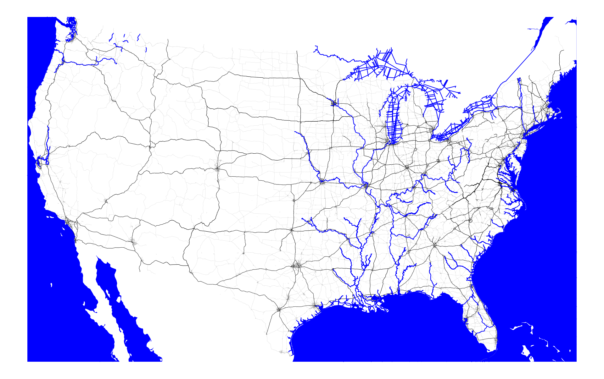

# Transportation Networks

The script, *trasnport.py* combines GIS data on the shape of the contiguous United States, its geographic subdivisions, and its transportation networks to create maps that can be used as inputs when calculating domestic trade costs. The modes of transportation to be mapped are roads, railroads, and navigable waterways. Additionally, a point in space (expressed in the same coordinates as the network) to represent each geographic unit is necessary to make use of the maps to calculate physical distances between domestic locations. Three geographic units will be considered: Commodity Flow Survey (CFS) Areas, Commuting Zones (CZ), and counties (CTY). 

## Land shape

The shape of the North American continent including and immediately surrounding the contiguous United States (and, inversely, the surrounding seas) is created by combining a shapefile on [international political boundaries from ARCGIS Hub](https://hub.arcgis.com/datasets/a21fdb46d23e4ef896f31475217cbb08_1) with a bounding box created from [the U.S. Census Bureau's county shapefile](https://www.census.gov/geographies/mapping-files/time-series/geo/carto-boundary-file.2010.html). The political boundary map contains shapes for the countries of the world including the U.S., Canada, Mexico, and Caribbean nations. The bounding box is created by first combining the counties of the contiguous United States and then finding the box that just fits this combined shape. Using geopandas, the following code excerpt combines the counties (by creating a new variable that is the same for all shapes *cont_us* and then applying *.dissolve(by='cont_us')*) and calculates the bounding box (using *.envelope*):

```
#combine counties into a single shape
county_map['cont_us'] = 1
cont_us_map = county_map.dissolve(by='cont_us')
#create bounding box and load into a geodataframe
bbox = cont_us_map.envelope
bounding_box = gpd.GeoDataFrame(gpd.GeoSeries(bbox), columns=['geometry'])
```

The final step is to intersect the map of political boundaries with the bounding box, such that only the parts of the world map that fall within the bounding box remain. The following code executes the intersection and combines the shapes of the remaining portions of various countries (part of Canada, part of Mexico, all of Cuba, etc.) into a single shape: 

```
#combine
us_land_map = gpd.overlay(land_map,bounding_box,how='intersection')
us_land_map['all'] = 1
us_land_map = us_land_map.dissolve(by='all')
```

## Navigable waterway network

The source of the network of commercially navigable waterways in the contiguous United States is [a shapefile](https://www.npms.phmsa.dot.gov/CNWData.aspx) compiled by the National Pipeline Mapping System (NMPS) (part of the U.S. Department of Transportation (DOT)) that takes the U.S. Army Corps of Engineers’ National Waterway Network and excludes waterways that are not suitable for commercial traffic. Since the DOT already isolated the relevant waterways, no additional steps are necessary beyond plotting the network.

## Road network

The data on the highway network for the contiguous United States is [a shapefile](https://www.fhwa.dot.gov/policyinformation/hpms/shapefiles_2017.cfm) from the Highway Performance Monitoring System of the Federal Highway Administration (FHA). For the road network, the FHA provides a classification of each road in the shapefile that can help determine which are meaningful for determining domestic trade costs. Specifically, the F_System codes outline the following categories:

1. Interstate
2. Principal Arterial-Other Freeways & Expressways
3. Principal Arterial-Other
4. Minor Arterial
5. Major Collector 
6. Minor Collector 
7. Local

With the goal of capturing the kind of roads that enable trade between locations the following categories, interstates (1), highways (2), and other arterial roads (3), will be extracted to form the road network.

## Rail network

The railroad network for the contiguous United States is derived from [a shapefile for all 50 states](https://hifld-geoplatform.opendata.arcgis.com/datasets/2a9677db741d4a78bd221586fe9a61f5_0) from the Homeland Infrastructure Foundation-Level Data (HIFLD) (part of the Department of Homeland Security (DHS)). The railroad data similarly have a classification, but it is simpler. Most of the railroad is designated as a "Main sub network" and this will be used as the primary rail network. The rest of the rail lines will make up a secondary set of the railroad network. In the literature, some authors make a distinction between "Class I/II/III" railroads. However, the purpose of the railroad network is to map the transportation network to the physical speed of travel over space and the definition of "Class I" railroad is in reference to the revenue of an entire operation, not the speed at which trains move on any specific track that the business owns so it does not make sense to me to split the network by "Class I/II/III" operated. 

## Plotting

To use these network plots as inputs into an estimation of trade costs (as in [Allen and Arkolakis (2014)](https://academic.oup.com/qje/article-abstract/129/3/1085/1818077)) it is necessary for each plot must be the same size in pixels and cover the same area. This can be accomplished by applying a similar method as was used to create the land map: a bounding box. With the same bounding box as the land map each network map is cropped so that only the nodes and edges within the bounds of the bounding box remain. Further, the bounding box, locations, and every network should share the same projection to ensure that the plots align. For example, when preparing the navigable waterway network, first the projection is changed to a standard and then it is clipped (i.e., cropped) with the bounding box:
 
```
#WATER
water_path = os.path.join(cd,r'CNW_v3_NAD83',r'CNW_v3_NAD83.shp')
water_map = gpd.read_file(water_path)
warnings.filterwarnings("ignore")
water_map = water_map.to_crs("EPSG:5070")
warnings.filterwarnings("default")
water_map = gpd.clip(water_map,bounding_box)

```

Another key 

## Locations

To create a list of unique locations and every unique pair of locations for different geographic units, the script starts by loading shapefiles for CFS areas, CZs, and counties that I created in [another repository](https://github.com/reasner/cfs_cz_shapefile_and_distances). For each geographic unit first calculate its centroid and extract the coordinates for the point. It is important to note that the centroid of a shape does not necessarily fall within the shape if it is concave! Despite this quirk the results seemed natural to me. However, it is possible to calculate the [representative point](https://geopandas.org/reference.html#geopandas.GeoSeries.representative_point) instead (which is forced to fall within the shape). The code excerpt below shows how to first calculate centroids and then extract the longitude (x) and latitude (y) coordinates for each:

```
cz_centroids_df.geometry = cz_centroids_df.centroid
cz_lon = cz_centroids_df.centroid.x.tolist()
cz_lat = cz_centroids_df.centroid.y.tolist()
```

The remaining code in this section saves a unique list of locations and coordinates as well as a list of every pair of locations (and the corresponding pair of coordinates) with two *for loops*.

## Networks

Transportation network maps of the U.S.

### Road network and navigable waterways



### Rail network and navigable waterways


